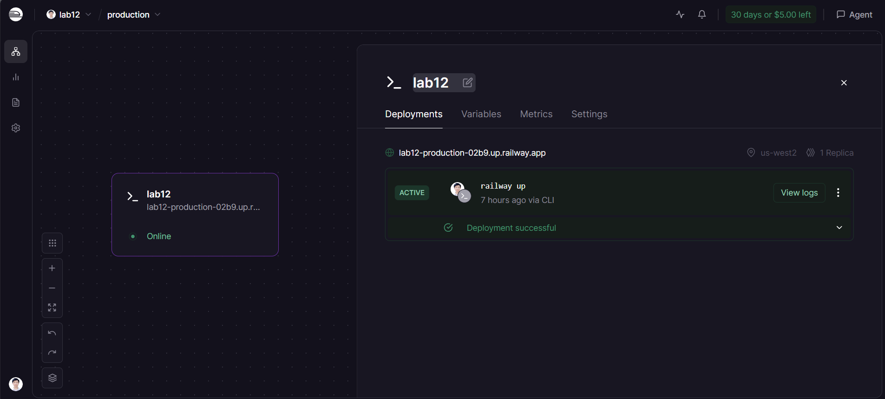
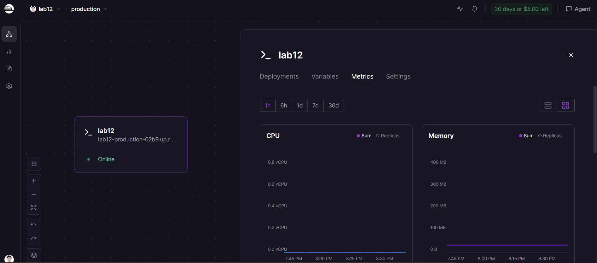

#  Delivery Checklist — Day 12 Lab Submission

> **Student Name:** Vũ Lê Hoàng
> **Student ID:** 2A202600342
> **Date:** 17/4/2026

---

##  Submission Requirements

Submit a **GitHub repository** containing:

### 1. Mission Answers (40 points)

Create a file `MISSION_ANSWERS.md` with your answers to all exercises:

```markdown
# Day 12 Lab - Mission Answers

## Part 1: Localhost vs Production

### Exercise 1.1: Anti-patterns found

1. API key hardcode trong code
2. Không có health check endpoint
3. Debug mode bật cứng
4. Không xử lý SIGTERM gracefully
5. Config không đến từ environment

### Exercise 1.3: Comparison table


| Feature      | Develop                 | Production                             | Why Important? |
| ------------ | ----------------------- | -------------------------------------- | -------------- |
| Config       | Hardcode trong code     | Đọc từ env vars     | Cùng một build có thể chạy dev/staging/prod; đổi cấu hình không cần sửa code. |
| Secrets      | `api_key = "sk-abc123"` | `os.getenv("OPENAI_API_KEY")` | Tránh lộ key trong repo; dễ rotate và phân quyền theo môi trường. |
| Port         | Cố định `8000`          | Từ `PORT` env var                      | Nền tảng cloud thường gán port động; app phải bind đúng port được cấp. |
| Health check | Không có                | `GET /health`                          | Load balancer/orchestrator biết instance còn sống và sẵn sàng nhận traffic. |
| Shutdown     | Tắt đột ngột            | Graceful — hoàn thành request hiện tại | Giảm lỗi khi deploy/scale-in; request đang xử lý không bị cắt đột ngột. |
| Logging      | `print()`               | Structured JSON logging                | Dễ parse, tìm kiếm và tích hợp với hệ thống log/monitoring tập trung. |


## Part 2: Docker

### Exercise 2.1: Dockerfile questions

1. Base image: `python:3.11`
2. Working directory: `/app`

...

### Exercise 2.3: Image size comparison

- Develop: 1.66 GB
- Production: 236 MB
- Difference: 83%

## Part 3: Cloud Deployment

### Exercise 3.1: Railway deployment

- URL: [https://lab12-production-02b9.up.railway.app](https://your-app.railway.app)
- Screenshot: [Link to screenshot in repo]

## Part 4: API Security

### Exercise 4.1-4.3: Test results

## Exercise 4.1: Test results
API key được check ở đâu?
Giá trị chuẩn lấy từ biến môi trường AGENT_API_KEY (mặc định "demo-key-change-in-production"):
API_KEY = os.getenv("AGENT_API_KEY", "demo-key-change-in-production")
api_key_header = APIKeyHeader(name="X-API-Key", auto_error=False)

Nếu sai key thì sao?
Không gửi header (hoặc rỗng): 401, body có detail giải thích thiếu key.
Gửi key nhưng khác API_KEY: 403, detail: "Invalid API key."

Làm sao rotate key?
Trong code hiện tại chỉ có một key đúng tại một thời điểm (API_KEY là một chuỗi). Rotate thực tế:

Đặt giá trị mới cho AGENT_API_KEY (file .env, Railway/Render secrets, Kubernetes Secret, v.v.).
Deploy / restart process để nó đọc env mới (giá trị được load lúc start, không tự đổi khi chỉ sửa secret trên dashboard mà không restart).
Cập nhật mọi client gửi header X-API-Key sang key mới.

## Exercise 4.2: Test results
Tokens:
DEMO_USERS = {
    "student": {"password": "demo123", "role": "user", "daily_limit": 50},
    "teacher": {"password": "teach456", "role": "admin", "daily_limit": 1000},
}

## Exercise 4.3: 
Algorithm được dùng: Sliding window

Limit 10 requests/minute cho rate_limit_user 
Limit 100 requests/minute cho rate_limit_admin

"Bypass" limit cho admin:
Không có bypass hoàn toàn. Admin dùng bộ giới hạn khác cao hơn. User demo có role admin là teacher / teach456 (auth.py). Đăng nhập bằng account đó thì trong vòng 1 phút được 100 lần gọi thay vì 10.

Test 20 lần — khi trúng limit
Với token student (role user): giới hạn 10/phút → từ request thứ 11 trở đi trong cùng cửa sổ ~60s sẽ nhận HTTP 429, body kiểu:

detail.error: "Rate limit exceeded"
detail.retry_after_seconds, và header Retry-After, X-RateLimit-*

### Exercise 4.4: Cost guard implementation

Phiên bản production — dùng Redis nên data bền vững, nhiều server instances cùng share chung 1 nguồn dữ liệu budget.

## Part 5: Scaling & Reliability

### Exercise 5.1-5.5: Implementation notes

```

---

### 2. Full Source Code - Lab 06 Complete (60 points)

Your final production-ready agent with all files:

```
your-repo/
├── app/
│   ├── main.py              # Main application
│   ├── config.py            # Configuration
│   ├── auth.py              # Authentication
│   ├── rate_limiter.py      # Rate limiting
│   └── cost_guard.py        # Cost protection
├── utils/
│   └── mock_llm.py          # Mock LLM (provided)
├── Dockerfile               # Multi-stage build
├── docker-compose.yml       # Full stack
├── requirements.txt         # Dependencies
├── .env.example             # Environment template
├── .dockerignore            # Docker ignore
├── railway.toml             # Railway config (or render.yaml)
└── README.md                # Setup instructions
```

**Requirements:**
-  All code runs without errors
-  Multi-stage Dockerfile (image < 500 MB)
-  API key authentication
-  Rate limiting (10 req/min)
-  Cost guard ($10/month)
-  Health + readiness checks
-  Graceful shutdown
-  Stateless design (Redis)
-  No hardcoded secrets

---

### 3. Service Domain Link

Create a file `DEPLOYMENT.md` with your deployed service information:

```markdown
# Deployment Information

## Public URL

Public URL: https://lab12-production-02b9.up.railway.app/

## Platform
Railway

## Test Commands

### Health Check
```bash
curl https://your-agent.railway.app/health
# Expected: {"status": "ok"}
```

### API Test (with authentication)
```bash
curl -X POST https://your-agent.railway.app/ask \
  -H "X-API-Key: YOUR_KEY" \
  -H "Content-Type: application/json" \
  -d '{"user_id": "test", "question": "Hello"}'
```

## Environment Variables Set
- PORT
- REDIS_URL
- AGENT_API_KEY
- LOG_LEVEL

## Screenshots
- 
- 
- 
```

##  Pre-Submission Checklist

- [X] Repository is public (or instructor has access)
- [X ] `MISSION_ANSWERS.md` completed with all exercises
- [X] `DEPLOYMENT.md` has working public URL
- [X] All source code in `app/` directory
- [X] `README.md` has clear setup instructions
- [X] No `.env` file committed (only `.env.example`)
- [X] No hardcoded secrets in code
- [X] Public URL is accessible and working
- [X] Screenshots included in `screenshots/` folder
- [X] Repository has clear commit history

---

##  Self-Test

Before submitting, verify your deployment:

```bash
# 1. Health check
curl https://your-app.railway.app/health

# 2. Authentication required
curl https://your-app.railway.app/ask
# Should return 401

# 3. With API key works
curl -H "X-API-Key: YOUR_KEY" https://your-app.railway.app/ask \
  -X POST -d '{"user_id":"test","question":"Hello"}'
# Should return 200

# 4. Rate limiting
for i in {1..15}; do 
  curl -H "X-API-Key: YOUR_KEY" https://your-app.railway.app/ask \
    -X POST -d '{"user_id":"test","question":"test"}'; 
done
# Should eventually return 429
```

---

##  Submission

**Submit your GitHub repository URL:**

```
https://github.com/your-username/day12-agent-deployment
```

**Deadline:** 17/4/2026

---

##  Quick Tips

1.  Test your public URL from a different device
2.  Make sure repository is public or instructor has access
3.  Include screenshots of working deployment
4.  Write clear commit messages
5.  Test all commands in DEPLOYMENT.md work
6.  No secrets in code or commit history

---

##  Need Help?

- Check [TROUBLESHOOTING.md](TROUBLESHOOTING.md)
- Review [CODE_LAB.md](CODE_LAB.md)
- Ask in office hours
- Post in discussion forum

---

**Good luck! **
